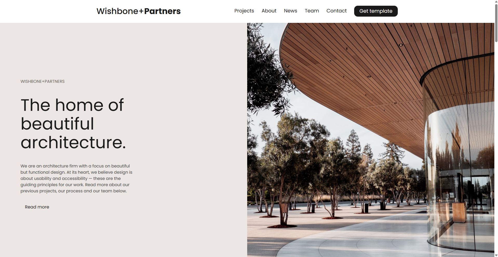

# Wishbone+Partners — архитектурное бюро

Лендинг архитектурного бюро: обложка, блок «о нас», этапы работы, проекты,
отзывы клиентов с портретами и подвал со ссылками на соцсети.

**[Открыть демо →](https://alonaborealis.github.io/architecture/)**



## Стек

- Семантическая вёрстка, HTML5
- SCSS: переменные, базовые стили, секции в одном файле
- normalize.css для выравнивания браузерных различий
- Prettier

## Особенности

Крупные фотографические секции собраны на составных фонах: изображение и
градиент задаются одним `background-image` через запятую, без лишних
обёрток в разметке.

Мобильной версии нет — макет рассчитан на десктоп.

## Локальный запуск

Сборка не требуется, стили уже скомпилированы в `styles/styles.css` —
достаточно открыть `index.html` в браузере.

Если нужно править SCSS, поставьте Sass и запустите слежение:

```
npm install
npx sass --watch styles/styles.scss:styles/styles.css
```
